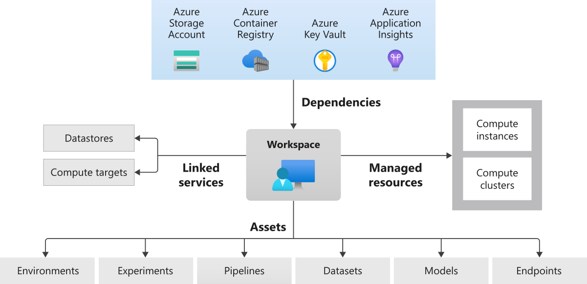

# Challenge 0: 前提条件

**[Home](./README.md)** - [Next Challenge >](./Challenge-01.md)

## Introduction

DevOps と同様、MLOps は非常に幅広いトピックであり、使用するツールに関しても多くの選択肢があります。このチャレンジでは、コンピュータに適切なツールがインストールされていることを確認することに焦点を当てます。

**チームメンバーは Hack セクションに記載されたタスクを行い、成功基準を満たす必要があります。タスクが完了した時点でコーチに成功基準を満たしていることを説明し、合格すれば次のチャレンジに進むことができます。**

**課題を解くためのヒントは学習リソース セクションの中に必ずあります。Hack がスタックしてしまったら学習リソースに立ち返ってください。**

## Description

本チャレンジでは、[Azure Machine Learning スタジオ](https://docs.microsoft.com/ja-jp/azure/machine-learning/overview-what-is-machine-learning-studio)と呼ばれるクラウドプラットフォーム上で開発を行います。

Azure Machine Learning ワークスペースと各アセットとリソースについて図と[解説](https://docs.microsoft.com/ja-jp/azure/machine-learning/concept-azure-machine-learning-architecture)を見ながら関係を理解します。

## 前提条件
- Azure のサブスクリプションを取得していること。お持ちでない場合は、[無料トライアル](https://azure.microsoft.com/free/)にお申し込みください。以下の Azure リソースを作成できることを確認します。
  - Application Insights
  - Azure Container Registry
  - Azure Container Instance
  - Azure Machine Learning
  - KeyVault
  - Storage Account

## Hack
以下の Azure Machine Learning アセットとリソースを作成します。Azure Machine Learning スタジオ UI から作成しても、Azure Machine Learning SDK から作成してもかまいません。
1. [Azure Machine Learning ワークスペース](https://ml.azure.com/)の作成。これは機械学習モデルの実験、学習、デプロイに使用する、クラウド上の基礎的なリソースです。
1. コンピューティング インスタンスの作成
1. コンピューティング クラスターの作成

ご自分のマシン上で作業する場合（オプション）

- Python のインストール、バージョンは最低でも 3.6.5 です。データサイエンス系の作業には Anaconda がより好ましい。
  - Anaconda - <https://docs.anaconda.com/anaconda/install/windows/>
  - Miniconda - <https://docs.conda.io/en/latest/miniconda.html>
  - Python - <https://www.python.org/downloads/>

  **Note:** 自分の OS の環境を壊さずに OpenHack 用の conda 環境を用意するのがおすすめです。インストールができない方は、Azure Machine Learning の Notebook 上で実行してください。

- Python モジュールが pip 経由でダウンロード可能であることを確認する（[PyPI](https://pypi.org)から、または内部のパッケージマネージャから）。
  - requirement.txt を参照
  - pip install -r requiments.txt
- Visual Studio Code または任意の Python IDE（Jupyter Notebook がよく使われます）
  - Python extensions

 

## 成功基準

- Azure Machine Learning ワークスペースが Azure サブスクリプションに作成されている。
- Azure Machine Learning ワークスペースにコンピューティング インスタンスおよびコンピューティング クラスターが作成されている。
- Python がインストールされており、Python コードを実行するための IDE がある。（オプション）

## 学習リソース
- [Azure Machine Learning のしくみ:アーキテクチャと概念](https://docs.microsoft.com/azure/machine-learning/concept-azure-machine-learning-architecture)
- [Azure Machine Learning ワークスペースとは](https://docs.microsoft.com/ja-jp/azure/machine-learning/concept-workspace)
- [Azure Machine Learning の利用を開始するために必要なワークスペース リソースを作成する](https://docs.microsoft.com/azure/machine-learning/quickstart-create-resources)
- [Azure Machine Learning コンピューティング インスタンスとは](https://docs.microsoft.com/ja-jp/azure/machine-learning/concept-compute-instance)
- [Azure Machine Learning コンピューティング クラスターとは](https://docs.microsoft.com/ja-jp/azure/machine-learning/how-to-create-attach-compute-cluster)