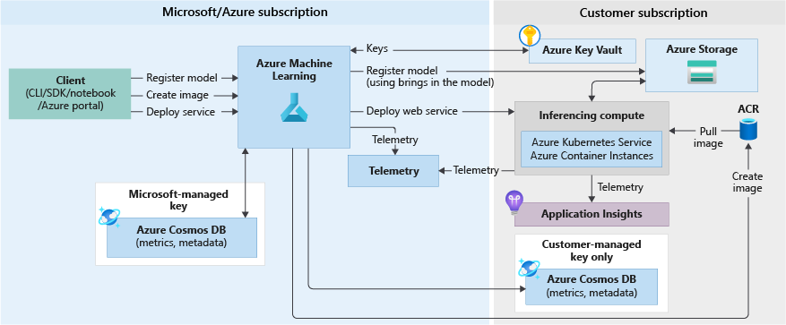

# Challenge 3 – クラウドにモデルをデプロイする

[< Previous Challenge](./Challenge-02.md) - **[Home](./README.md)** - [Next Challenge >](./Challenge-04.md)

## Introduction

この課題の目的は、作成した機械学習モデルを Azure Machine Learning に登録し、Web サービスとして Azure クラウドにデプロイする方法を理解することです。

Web サービスとしてモデルをデプロイする場合、エンドポイントを Azure Container Instances、Azure Kubernetes Service、または FPGA にデプロイできます。モデル、スコアリング スクリプト、および関連ファイルからサービスを作成します。これらは、モデルの実行環境を含むベース コンテナー イメージに配置されます。イメージには、Web サービスに送信されるスコアリング要求を受け取る、負荷分散された HTTP [エンドポイント](https://docs.microsoft.com/ja-jp/azure/machine-learning/concept-azure-machine-learning-architecture#endpoints)があります。

## Description
次の図は、Web サービス エンドポイントとしてデプロイされているモデルの推論ワークフローを示しています。

図と[解説](https://docs.microsoft.com/ja-jp/azure/machine-learning/concept-azure-machine-learning-architecture#web-service-endpoint)を見ながらそれぞれのサービスとプロセスについて理解してから、以下のタスクを完了させます。

### Work
1. 新しいノートブックを作成します。
1. [Challenge 2](./Challenge-02.md) で作成したモデルを Azure Machine Learning ワークスペースに登録します。
1. Azure クラウドで推論を実行するための**スコアリング スクリプト**を作成します。今回は事前に提供された `./scripts/score.py` の中身を参照し、[Challenge 1](./Challenge-01.md) で Notebook セルに記載されているコードと見比べながら差異を明らかにします。
1. 事前に提供された conda 環境仕様 YAML ファイル `arima-env.yml` をロードして**環境**を作成します。すでに存在する場合は再利用が可能です。
1. **スコアリング スクリプト**と**環境**を**推論構成**にパッケージ化します。
1. 推論 Web サービスが実行するために必要とするメモリとコアの量を指定した**デプロイ構成**を定義して `Azure Container Instances(ACI)` にデプロイします。
1. 推論 Web サービスをテストします。

## 成功基準
- Azure Machine Learning ワークスペースにモデルが登録されていること。
- スコアリング Python スクリプトのコードを理解すること。
- スクリプトの実行構成に環境、コンピューティング ターゲット、スコアリング Python スクリプトをセットし、リアルタイムエンドポイントのデプロイに成功(サービスの状態が **Healthy**)すること。
- 推論 Web サービスにリクエスト送信し推論結果が返却されること。

## 学習リソース
 - [機械学習モデルを Azure にデプロイする（Python）](https://docs.microsoft.com/ja-jp/azure/machine-learning/how-to-deploy-and-where?tabs=python)
 - [チュートリアル: サンプルの Jupyter Notebook を使用して画像分類モデルをトレーニングおよびデプロイする](https://docs.microsoft.com/ja-jp/azure/machine-learning/tutorial-train-deploy-notebook)
 - [Azure Machine Learning のしくみ:アーキテクチャと概念](https://docs.microsoft.com/azure/machine-learning/concept-azure-machine-learning-architecture)
 