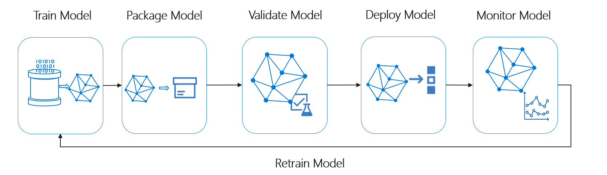

# Challenge 6 – 再トレーニングとモデル評価

[< Previous Challenge](./Challenge-05.md) - **[Home](./README.md)** - [Next Challenge >](./Challenge-07.md)

## Introduction

新しいデータが継続的にインジェストされてトレーニングパイプラインに投入する仕組みが整いました。ただ、この仕組みでは新しいデータを投入してトレーニングしたとき、モデルの精度が低下するという問題が起きるようになってきました。どうやら最近起きた世界的なサプライチェーンの混乱によりデータ自体の分布が変化してしまった可能性があります。

新しいデータが、モデルを学習させたときの元の学習データから乖離すると、モデルの性能は劣化します。モデルドリフトと呼ばれるこの概念は、新しいデータが利用可能になったときに、現在の状態を反映するようにモデルを再トレーニングすることで緩和することができます。

## Description

本チャレンジではシンプルな評価テストとして、新しいモデルと既存のモデルを比較します。新しいモデルの精度が優れている場合にのみ、そのモデルを昇格させます。そうでない場合、そのモデルは Azure Machine Learning モデルレジストリに登録されないようにします。

これまでのチャレンジにより、モデルのトレーニングプロセスが上図のような自動実行するサイクルとして完成させる準備が整いました。

## Hack
1. モデルを再トレーニングするには、新しいデータでトレーニング スクリプトを更新してください。
    1. トレーニング スクリプト `./scripts/train.py` 内でロードしている Dataset に注目してください。初期モデルは 2013 年のトランザクションデータで学習されました。
    1. 2013 年のデータと一緒に、`00_LoadData.ipynb` で作成した 2014 年のトランザクションデータも読み込みます。
    1. これら 2 つのデータセット/データフレームを結合し、この大きなデータセットでARIMA 学習モデルを構築します。
1. 現行モデルと最新のモデルの精度を比較して、精度が高くなったときのみモデルレジストリに登録するコードを作成します。
    1. 新たにノートブックを作成します。
    1. パイプラインの `train` で作成したモデルの精度メトリクスを `metric.json` から取得します。
    1. 比較対象の既存モデルは、`metric.json` からモデル名を取得し、[Model クラス](https://docs.microsoft.com/python/api/azureml-core/azureml.core.model.model?view=azure-ml-py)に指定することで取得します。モデルオブジェクトのタグから精度メトリクス情報を取得します。
    1. 比較に使用する精度メトリクスを選択し、新たに作成したモデルの精度が既存モデルの精度より悪かった場合パイプライン実行をキャンセルします。
    1. このコードを `evaluate.py` として書き出します。
1. 機械学習パイプラインの `train` と `register` の間に `evaluate.py` を実行するステップを追加します。
1. トレーニングの変更を反映させるため、機械学習パイプラインを再実行します。新しいモデルの評価指標が以前のモデルよりも優れている場合、再トレーニングしたモデルに対して新しい Web サービスが作成されます。
1. 機械学習パイプラインの成果物とアウトプットをレビューします。

## 成功基準

- 再トレーニングしたモデル（必要に応じてパフォーマンスを向上させたもの）を作成し、モデルレジストリに登録されること。
- 再トレーニングしたモデル用の “healthy” ステータスの ACI デプロイが、リアルタイムエンドポイントに作成されていること。

## 学習リソース

- [MLOps: Azure Machine Learning を使用したモデルの管理、デプロイ、系列追跡、監視](<https://docs.microsoft.com/azure/machine-learning/concept-model-management-and-deployment>)
- [MLOps リファレンス・アーキテクチャ](<https://docs.microsoft.com/azure/architecture/reference-architectures/ai/mlops-python>)

## さらなる学習
Azure Machine Learning には、トレーニングに用いるデータの変化であるデータ ドリフトを監視する機能が搭載されています。これにより、増え続ける新しいデータのコレクションを元のトレーニング データと定期的に比較し、モデルの精度に影響する可能性のあるデータの傾向の変化を特定することができます。

データ ドリフトに関するアラートを設定して、市場の変化によってデータセットのプロファイルが大きく変わった場合にアラートを送信するように設定してください。

- [データセットでデータ ドリフトを検出する](https://docs.microsoft.com/azure/machine-learning/how-to-monitor-datasets)
## おめでとうございます

この Hack のチャレンジは終了しました。コンテンツは継続的に更新しています。今後のフェーズでは、AKS Data Drift に加え、ONNX や mlflow など他の ML プラットフォームも取り込んで、このソリューションを拡張していく予定です。ご期待ください。
